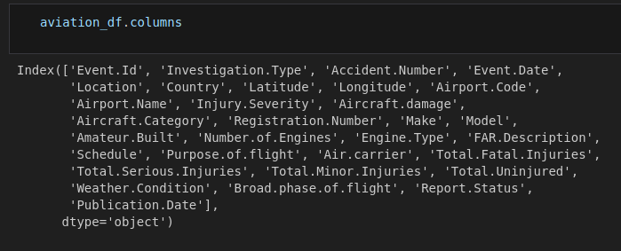

# MADRIGAL ELECTROMOTIVES LOWEST RISK AIRCRAFT ANALYSIS

> **Author**: Ngundo Muithya

> **Email**: ngundolarrymuithya@gmail.com

## OVERVIEW

Madrigal Electromotives seeks to expand its business portfolio by moving into the airplane business. As the chief data scientist, I have been tasked with finding the lowest risk airplanes that the company can invest in.

## BUSINESS PROBLEM

Finding the lowest risk aircraft for the company to invest in

## DATA

The data was aviation accident data from 1962 to 2023 by the National Transport Safety Board.

## METHODS

The main python library used in this analysis was **Pandas**.

I started by looking at the columns in the dataset:

From these I identified columns of interest:

The dataset contained info on all kinds of aircraft from balloons to gyrocraft. I chose to focus solely on airplanes.

I then trimmed my airplane data to remain with data from the columns of interest only.

Using this dataset, I dropped all the records with null values and remained with 3201 records

I identified the safe airplanes from this dataset as those with 0 accidents. I stored them in a CSV

I then identified the super safe airplanes as those with 0 accidents as well as those with low minor injuries and high uninjured. I also stored these in a CSV

I went further and identifed the safest models and the most critical phase of flight.

## RESULTS

### Number of accidents and incidents per weather condition

The weather condition associated with the most accidents and incidents was **Visual Meteorological Condition(VMC)** weather i.e. when the sky is clear which seems counterintuitive. Either way, pilots need to be very careful when the sky is clear as they would if it were not.

### Number of incidents per phase of flight

The phases of flight associated with the most incidents were **Takeoff** and **Landing**.

### Threat level per make of airplane

I compared Boeing to Airbus to see which was safer. **Airbus** came out on top.

## Conclusions

The safe airplanes details are stored in these CSVs:
* [Safe Airplanes](./Data/safe_airplanes_full.csv)
* [Super Safe Airplanes](./Data/super_safe_airplanes_full.csv)

The safest models are [here](./Data/top_makes_and_models.csv)

The weather condition associated with a high number of incidents is **VMC**.

The most critical phase of flight that pilots of these airplanes need to focus on is **Takeoff**.

When choosing between the two most popular air carriers, Boeing and Airbus, go with **Airbus**.

## Recommendations

Buy airplanes that are in the safe airplanes CSVs

Buy models that are in the safe models CSV

Pilots who operate these aircraft need to be extra vigilant during VMC weather and during takeoff and landing

When choosing between Boeing and Airbus, go with Airbus

## Next Steps

Determine the safest aircarrier

The dataset can still be used to determine whether amateur built airplanes are more likely to crash.

## For more information

For more information, visit the [Jupyter Notebook](./Notebook.ipynb), the [Tableau Dashboard](https://public.tableau.com/views/MadrigalElectromotivesLowestRiskAircraftAnalysis/Dashboard1?:language=en-US&:sid=&:redirect=auth&:display_count=n&:origin=viz_share_link) and the [Presentation](./Presentation.pdf).

Thank you!